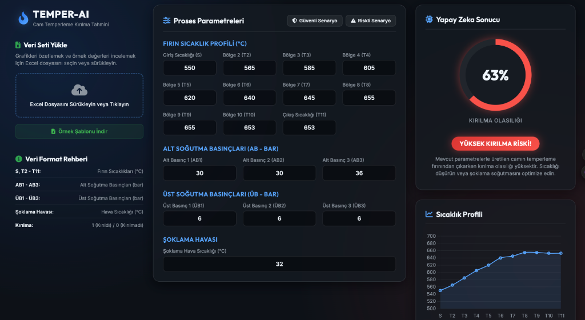

# Cam Temperleme Kırılma Tahmin Modeli & Dashboard (TEMPER-AI)

Bu proje, cam temperleme fırını sıcaklık profilleri, soğutma hava basınçları ve şoklama hava sıcaklığı parametrelerine dayanarak cam kırılma riskini gerçek zamanlı tahmin eden makine öğrenmesi modeli ve etkileşimli web arayüzünü (Dashboard) içermektedir.

## 🌟 Proje Özellikleri

*   **Gerçek Zamanlı Tahmin Motoru:** Python ile eğitilen Lojistik Regresyon modeli katsayıları ve `StandardScaler` parametreleri doğrudan tarayıcıya (JavaScript) entegre edilmiştir. Formdaki değerleri değiştirdiğinizde tahmin anlık olarak güncellenir.
*   **Örnek Senaryo Butonları (Presets):** Veri setindeki başarılı ve başarısız tipik fırın çalışma parametrelerini tek tıkla yükleyen hızlı ayarlar mevcuttur.
*   **Proses Format Rehberi:** Fırın bölgeleri, hava basınçları ve şoklama parametrelerinin anlam ve birimlerini açıklayan bilgi paneli yer almaktadır.
*   **Excel Şablonu İndirme:** Kullanıcıların veri formatını inceleyebilmesi veya yeni veri yükleyebilmesi için örnek Excel şablonu indirme seçeneği sunulmuştur.
*   **Gelişmiş Görselleştirme:** Excel dosyası yüklendiğinde SheetJS ile okunarak fırın sıcaklık profilleri, şoklama sıcaklığı kırılma dağılımı ve basınç ilişkileri etkileşimli grafiklerle özetlenmektedir.

---

## 📊 Veri Seti ve Öznitelik Formatı

Web uygulaması ve makine öğrenmesi modeli aşağıdaki kolon yapısını beklemektedir:

| Kolon Adı | Açıklama | Birim |
| :--- | :--- | :--- |
| **S** | Giriş Bölgesi Sıcaklığı | °C |
| **T2 - T11** | Fırın Bölge Sıcaklıkları (10 Bölge) | °C |
| **AB1 - AB3** | Alt Soğutma Basınçları | bar |
| **ÜB1 - ÜB3** | Üst Soğutma Basınçları | bar |
| **Şoklama Hava Sıcaklığı** | Şoklama Havası Sıcaklığı | °C |
| **Kırılma** | Kırılma Durumu (Hedef Değişken) | 1 (Kırıldı) / 0 (Kırılmadı) |

---

## 🛠️ Makine Öğrenmesi Modeli Detayları

*   **Algoritma:** Lojistik Regresyon (Logistic Regression) Pipeline
*   **Veri Ön İşleme:** Özellikler arasındaki ölçek farkını gidermek amacıyla `StandardScaler` uygulanmıştır.
*   **Sınıf Dengeleme:** Veri setindeki dengesiz sınıf dağılımı (%81.8 kırılma, %18.2 kırılmasız) nedeniyle model eğitiminde `class_weight='balanced'` kullanılarak tahmin doğruluğu ve F1 skoru artırılmıştır.
*   **Çalışma Yapısı:** Jupyter Notebook üzerindeki eğitim çalışmaları [Copy_of_Temper_V4.ipynb](Copy_of_Temper_V4.ipynb) dosyası üzerinden yürütülmüştür.

---

## 🚀 Nasıl Çalıştırılır?

1.  Proje klasörünü bilgisayarınıza indirin.
2.  Klasör içerisindeki [index.html](index.html) dosyasına çift tıklayarak herhangi bir modern web tarayıcısında (Chrome, Safari, Firefox vb.) açın.
3.  Tahmin panelindeki parametreleri değiştirerek gerçek zamanlı sonuçları izleyin veya [AK0001C.xlsx](AK0001C.xlsx) dosyasını sürükleyip bırakarak yükleyin.
